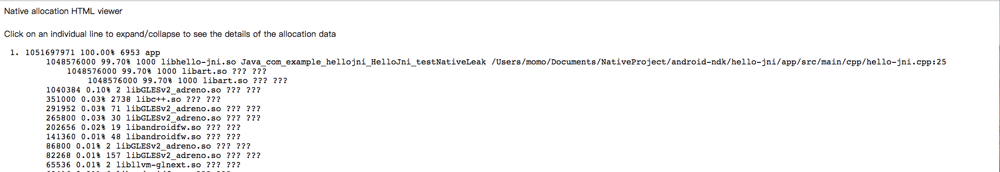
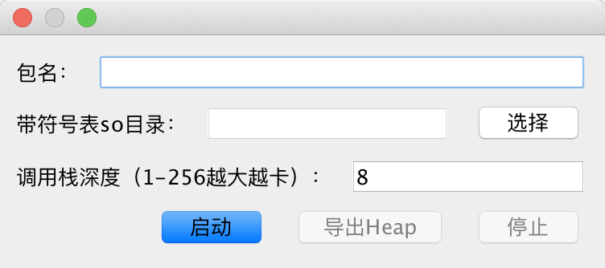

# malloc-debug
## 简介
本仓库用来记录`Malloc Debug`学习过程，具体内容见[Android native memory leak detect](https://blog.csdn.net/a740169405/article/details/81032228)
## 例子
demo/目录下的Android项目是一个带内存泄露代码的工程

使用python脚本导出后，加入--html和--reverse参数后的得到结果




# GUI程序使用
为了方便使用，封装了一个GUI程序，方便启动malloc debug，自动导出数据等([tools目录下](./tools))

## 1. 项目结构说明
`git clone`该项目的所有文件到本地，比如放到`malloc_debug`目录下，使用terminal cd进入`tools`目录，目录下有所有需要使用到的工具和脚本。
> 不要把脚本转移到其他地方使用，所有脚本都需要使用当前目录下的资源

## 2. 启动内存泄露追踪
使用命令行 cd 到下载的目录，执行`java -jar malloc_debug.jar`启动swing程序（直接双击打开jar无法使用）


启动：
1. 输入包名
2. 选择带符号表的so所在目录（不选择也行，但是无法获取代码行号信息）
3. 点击启动

## 3. 导出内存heap文件
当发现native内存升高的时候，点击`导出Heap`将会导出native内存申请信息，并自动在浏览器中打开

## 4. 使用注意事项
### Root手机，要求应用为dev包或者debuggable的release包
如果你是root手机，收到如下错误的话
```
Security exception: Process not debuggable: ProcessRecord{63877cc 13157:com.example.hellojni/u0a126}
```
那么需要在打包的时候，往清单文件中的<application中加入`android:debuggable="true"`属性。
```
<application
        android:allowBackup="true"
        android:icon="@mipmap/ic_launcher"
        android:label="@string/app_name"
        android:roundIcon="@mipmap/ic_launcher_round"
        android:supportsRtl="true"
        android:theme="@style/AppTheme"
        android:debuggable="true"
        android:name=".IMApplication">
```

## 5. 结果分析
内容如下：

```
1. 1051678158 100.00% 6904 app
2. 1554780 100.00% 13909 zygote
```
`app`结尾的这一行是应用程序模块申请的内存，一般我们只需要关心这一块的内存申请情况
每列的意思分别是：
`申请的内存字节数` `申请的内存占整体的内存百分比` `申请的内存次数` `申请内存所在二进制文件名称`

> 注意，每一行点击之后都会展开新的内容，就如同Java报错后的调用栈信息。

```
1051678158 100.00% 6904 app
	1048576000 99.71% 1000 libhello-jni.so ??? ???
		1048576000 99.71% 1000 libart.so ??? ???
			1048576000 99.71% 1000 libart.so ??? ???
				1048576000 99.71% 1000 libart.so ??? ???
	1040384 0.10% 2 libGLESv2_adreno.so ??? ???
	348656 0.03% 2711 libc++.so ??? ???
	279616 0.03% 68 libGLESv2_adreno.so ??? ???
	265800 0.03% 30 libGLESv2_adreno.so ??? ???
	202656 0.02% 19 libandroidfw.so ??? ???
	141360 0.01% 48 libandroidfw.so ??? ???
```
每一行末尾有两个`???`第一个`???`应该显示的是申请内存的代码所在文件路径，第二个`???`应该显示的是申请内存行号。

## 6. 配置带符号表的so文件，导出申请内存的行号信息
如果使用工具的时候，设置了带符号表的so所在目录，那么导出的内存信息将会带代码行号，方便定位问题

```
1051697971 100.00% 6953 app
	1048576000 99.70% 1000 libhello-jni.so Java_com_example_hellojni_HelloJni_testNativeLeak /Users/qiuliang/Documents/NativeProject/android-ndk/hello-jni/app/src/main/cpp/hello-jni.cpp:25
		1048576000 99.70% 1000 libart.so ??? ???
			1048576000 99.70% 1000 libart.so ??? ???
				1048576000 99.70% 1000 libart.so ??? ???
1040384 0.10% 2 libGLESv2_adreno.so ??? ???
351000 0.03% 2738 libc++.so ??? ???
291952 0.03% 71 libGLESv2_adreno.so ??? ???
265800 0.03% 30 libGLESv2_adreno.so ??? ???
202656 0.02% 19 libandroidfw.so ??? ???
```


# GUI程序源码
[看这里](./gui-source/src)

